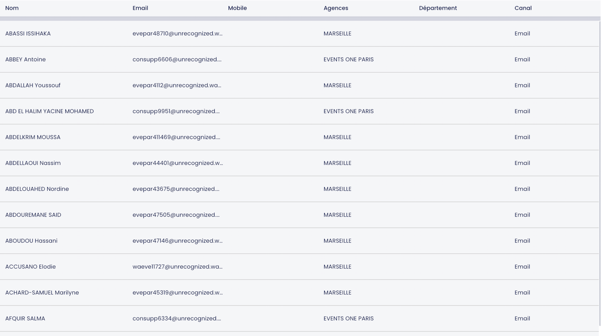

### Welcome! 

#### Main goals of Test task from a technical management perspective:
- candidate can analyze the incoming business goals and create a plan of how to  implement it
- candidate can estimate his solution in hours or story points
- candidate can work independently without the detailed technical description but strongly inline with acceptance criteria
- candidate has strong experience with project technologies on the framework and database layer. 

#### Main goals of Test task from a technical background of the candidate:
- strong practical and enterprise experience with development API based on ZF2 ecosystem
- base knowledge of PostgreSQL or MySQL dialects and complex querying for them
- base knowledge of advanced SQL concepts such as Stored Procedures, Triggers, Views
- practical experience with the implementation of Main Design Patterns such as "Factory", "Singleton", "Data Mapper"
    
#### To be successful in resolving the test task please follow the next steps:
- If you are reading this Readme It means you have the access to the repo. Please clone it to local machine.
- Create your own feature branch where you will be able to commit your solution and create Pull Request at the final.
- The project contains the folder directory "estimations". Please create an empty text file inside.
- You will need the list of steps to implement the solution. 
Please describe the list of steps you will follow and provide a rough estimation.
 Clarify how many time you need to implement solutions on all steps separately.
- When the estimation will be ready, please commit the changes to git.
- During the implementation, please commit all steps from your estimation separately.
- The repository already has the initial platform to develop the Web API based on ZF2. Please use it.
Do not hesitate to add any required packages or extensions for the implementation of the solution.

- Client-side App has the next screen to manage a list of contacts. Please see the screenshot below.
The main goal of the test task is to partially implement REST API Endpoint to use for "Create a new contact".

  

- Please add route to process POST request based on next URL `http://api.boilerplate.local:8080/contacts/:contactId`
- Restrict the segment of the route ":contactId" to match only with digits.
- Create and initialize the list of classes to implement the logic of the API endpoint which follow M*C pattern
- Define the class of Controller which cannot be extended, and the method postAction in it which cannot be overridden.
- API endpoint should contain custom protection. The only request with HTTP header `X-Access: allowed` should be processed. 
Otherwise, the exception with status code 401 should be fired.
- To interact with the database and create a record in the table 'users' implemented logic based on DataMapper design pattern and ZF2 query builder.
- Use pattern Factory to inject class of Mapper to ZF2 DI container.
- We would like to prevent the sharing of the instanced Mapper between the classes which use it. 
Please apply the setting to do this.
- During the implementation of "Create contact" API endpoint, we need to consider the future feature "Search compound names". 
- In the project We have already created file `sql/searchCompoundNamesIndex.sql`.
- Please use SQL to create DB query to follow the next acceptance criteria:
    1) Create on DB table users INDEX USING GIN extension
    2) the index should take as a value which is returned from function `fn_concat_user_attributes_by_space on table users`
    3) need to develop DB function followed next signature `fn_concat_user_attributes_by_space(users.first_name VARCHAR, users.last_name VARCHAR)`
    4) DB function encapsulated inside the logic to concatenate the arguments with space
    
#### This is our final goal. We wish you the successful completion of the planned steps. Please, do not forget to push the solution to GitHub. 

#### Note! Provided tasks and scenarios take into account just simple solutions in the code base. No complex testing required. In common cases, test tasks should be resolved from 2 up 4 hours by an experienced developer. The main idea is the usage of previous experience with development projects based on the Zend Framework ecosystem. Common approaches and fundamental knowledge of Design Patterns will help to resolve tasks without complex step-by-step debugging and investigation of the local environment.

#### On the other hand, in case the candidate will face the complexity of how to apply a solution without IDE code autosuggestions and step-by-step debugging. The usage of the local environment is available with some shell commands to simplify the setup process.

#### Preconditions od system requirement to use local environment:
- Linux OS only: Ubuntu 18.04 LTS (Bionic Beaver) or MacOS
- [Docker Engine: 18.09.0](http://docs.docker.com/install/)
- [docker-compose](http://docs.docker.com/compose/install/)

#### Local environment shell scripts:
- Initialise local environment `bin/init`
- Shutdown local environment `bin/down`
- Review status of containers `bin/ps`
- Start local environment at the second time `bin/run`
- Review logs of containers `bin/logs`

